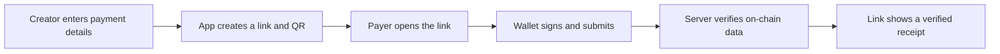

# Stellar HareLink

**Create a payment link. Get paid on Stellar.**

[](#project-status)
[](#network-and-assets)
[](#license)
[](https://telluscoop.org/)

Stellar HareLink is an open-source, non-custodial web application for creating and paying shareable payment requests on Stellar. A recipient defines an amount and asset, shares a link or QR code, and the payer approves the transaction in their own wallet.

The application never requests, receives, or stores a private key or seed phrase.

> **Project status:** release candidate. **`v0.1.0-rc.1`** is deployed and tested (unit, integration, and browser suites green; live test payments in XLM and USDC verified against Testnet). The `v0.1.0` target remains **September 16, 2026**, pending a clean-room setup by someone outside the project. This repository is experimental and has not been audited.

## Why this project exists

Receiving a payment on Stellar should not require sending a wallet address, amount, asset, and memo as separate instructions. Stellar HareLink packages those details into one human-readable page while preserving self-custody.

This is a public, community-owned utility, not a merchant platform. Unlike hosted payment or checkout services, it is meant to be forked, adapted to a local asset or community, and run under an MIT license. Its differentiator is server-side verification: a link changes to `paid` only when the server confirms the transaction against Stellar network data, so pretending to pay is not enough.

The project is designed to be:

- **Useful:** it solves one clear payment-request problem.
- **Non-custodial:** users authorize transactions in their own wallets.
- **Verifiable:** the server confirms the payment against Stellar network data.
- **Forkable:** configuration, local setup, and deployment are documented.
- **Safe by default:** Testnet is the default and supported assets are allowlisted.
- **Community-friendly:** small, reviewable PRs; behavior tests; issues labeled for onboarding.
- **Open:** the software is released under the MIT License.

Success for this project is measured in community signals, not traffic: real forks, external pull requests, and a first-time flow that works in about ten minutes.

## How it works



## Version 0.1 scope

### Included

- Create a single-use payment link.
- Request a fixed amount in XLM or an allowlisted USDC asset.
- Add a short title, description, expiration date, and generated reference memo.
- Share the payment page by URL, QR code, or a downloadable share card with shortcuts for X and WhatsApp.
- Connect a supported Stellar wallet and sign without exposing secret keys.
- Check destination readiness for credit assets before payment.
- Submit a classic Stellar `Payment` operation on Testnet.
- Verify network, transaction success, destination, asset, amount, memo, and uniqueness on the server.
- Display `pending`, `paid`, or `expired` states.
- Show a receipt with the transaction hash and a link to a network explorer.
- Work on mobile and desktop.

### Not included

- Custodial accounts or key management.
- Mainnet activation in the public demo.
- Fiat checkout, card payments, swaps, or exchange-rate guarantees.
- Refund automation, split payments, subscriptions, or recurring billing.
- Merchant analytics, teams, webhooks, or an authenticated dashboard.
- Soroban smart contracts; the MVP uses Stellar's standard payment operation.
- Tellus Passport or an event-management kit. Those are separate products and are not part of this open-source repository.

## Trust model

The browser may propose a transaction, but it cannot decide that a link has been paid. A link changes to `paid` only after server-side verification finds a successful Stellar transaction matching every expected field:

1. Correct network.
2. Successful transaction and ledger inclusion.
3. Expected destination account.
4. Exact asset code and issuer, or native XLM.
5. Exact decimal amount.
6. Exact generated memo/reference.
7. Transaction created within the permitted payment window.
8. Transaction hash not already assigned to another payment link.

## Proposed stack

| Layer | Choice | Purpose |
| --- | --- | --- |
| Application | Next.js + TypeScript | Full-stack web app and API routes |
| Interface | Tailwind CSS | Responsive UI with Tellus design tokens |
| Stellar | Stellar JavaScript SDK | Build transactions and read network data |
| Wallet | `stellar-tools/stellar-wallets-kit` adapter (v0.2) | Multi-wallet connection and signing |
| Data | PostgreSQL via `LinkStore` boundary; in-memory fallback | Persist payment-link state and verified receipts |
| Validation | Zod | Shared input and environment validation |
| Tests | Vitest + Playwright | Unit, integration, and browser coverage |
| Deployment | Vercel-compatible runtime | Simple fork-and-deploy path |

Wallet and database adapters are isolated behind interfaces (`src/lib/db/types.ts` for storage) so forks can choose a different compatible provider. The wallet boundary swaps Freighter for the community `stellar-wallets-kit` in `v0.2` so each fork can pick wallet providers without touching core verification logic.

## Routes and API

| Route | Status | Responsibility |
| --- | --- | --- |
| `/` | Implemented | Product explanation and primary action |
| `/create` | Implemented | Create and validate a payment request, QR share |
| `/pay/[slug]` | Implemented | Public payment page and wallet flow |
| `/receipt/[slug]` | Implemented | Shareable verified receipt (paid links) |
| `POST /api/links` | Implemented | Validate, check destination readiness, create a link |
| `GET /api/links/[slug]` | Implemented | Return safe public link data |
| `POST /api/links/[slug]/verify` | Implemented | Verify a submitted transaction hash on-chain |

All API responses use a stable envelope: `{ ok: true, data }` or `{ ok: false, error: { code, message } }`. Error codes are shared in `src/lib/api/response.ts`. Every browser-supplied value is re-validated on the server with Zod (<code>src/lib/validation/link-schema.ts</code>).

## Repository structure

```text
stellar-harelink/
├── src/
│   ├── app/
│   │   ├── api/links/            # POST /api/links
│   │   ├── api/links/[slug]/     # GET + POST verify
│   │   ├── api/links/[slug]/verify/
│   │   ├── assets/[name]/        # static asset route
│   │   ├── create/               # creation page + QR share
│   │   ├── pay/[slug]/           # payment page + wallet flow
│   │   └── receipt/[slug]/       # shareable receipt
│   ├── components/
│   ├── lib/
│   │   ├── api/
│   │   ├── config/
│   │   ├── db/
│   │   ├── links/
│   │   ├── payments/
│   │   ├── stellar/
│   │   ├── validation/
│   │   └── wallet/
│   └── ...
├── assets/                       # static media served at /assets
├── db/migrations/                # PostgreSQL schema
├── tests/
├── .env.example
├── CONTRIBUTING.md
├── SECURITY.md
├── plan.md
└── roadmap.md
```

## Network and assets

The public `v0.1.0` demo runs on Stellar Testnet. XLM is native. USDC is represented as a configured Stellar credit asset and must include both an asset code and issuer account.

The application must not silently substitute an issuer. A fork must explicitly configure its allowed asset and confirm that the destination can receive that asset. Mainnet remains disabled until a separate release review.

## Local development

```bash
git clone https://github.com/Tellus-Cooperative/stellar-paylink.git
cd stellar-paylink
pnpm install
cp .env.example .env.local
pnpm dev
```

Open `http://localhost:3000`.

You can create a link against the running stack without the UI:

```bash
curl -X POST http://localhost:3000/api/links \
  -H 'content-type: application/json' \
  -d '{"destination":"G...","asset":{"type":"native"},"amount":"25.5","title":"Café"}'
```

A random destination is accepted while it does not exist yet; link `PENDING` stays eligible until a matching verified transaction arrives. Payment links live in PostgreSQL when `DATABASE_URL` is set (migrate with `pnpm db:migrate`), otherwise in an in-memory store for zero-setup local runs. The storage contract in `src/lib/db/types.ts` is the single boundary.

### Environment variables

```dotenv
NEXT_PUBLIC_APP_URL=http://localhost:3000
STELLAR_NETWORK=testnet
STELLAR_HORIZON_URL=https://horizon-testnet.stellar.org
DATABASE_URL=
USDC_ASSET_CODE=USDC
USDC_ASSET_ISSUER=
```

`USDC_ASSET_ISSUER` must be a valid `G...` address; leave it empty to run XLM-only. Configuration is validated at startup by Zod in `src/lib/config/env.ts`. No secret key, seed phrase, or custodial signing credential belongs in the environment file.

### Deployment and asset configuration

There is no custodial signing or private key anywhere in the deployment: the app only reads network data with Horizon on Testnet. To deploy your own instance:

1. Fork the repository and set these environment variables in your platform:
   - `NEXT_PUBLIC_APP_URL` must be your public base URL (e.g. `https://your-domain.example`). It is embedded at build time, so deploy as a fresh build after changing it.
   - `STELLAR_NETWORK=testnet` and `STELLAR_HORIZON_URL=https://horizon-testnet.stellar.org` are the safe defaults.
   - `DATABASE_URL`: leave it empty for the in-memory store, or set a PostgreSQL DSN (e.g. Neon) and run `pnpm db:migrate` so links persist across restarts.
   - `USDC_ASSET_CODE` / `USDC_ASSET_ISSUER`: to accept USDC, set the code and the explicit issuer account for your asset. Leave `USDC_ASSET_ISSUER` empty for an XLM-only deployment. The app never invents an issuer and refuses to pay credit assets whose code-issuer pair is not configured.
2. Build with `pnpm build` and start with `pnpm start`. The app is a standard Next.js server, so any provider that runs a Next.js server works; `vercel.json` documents the preset used for the reference deploy.
3. Verify readiness before announcing: create a link, open `/create`, and confirm the success panel shows an amount, the memo, and readiness for the destination account/trustline.

The reference Testnet demo runs at <https://stellar-paylink-lac.vercel.app>.

## Quality commands

```bash
pnpm dev          # run the local Next.js app
pnpm lint         # check lint rules
pnpm typecheck    # run TypeScript checks
pnpm test         # run unit tests (Vitest)
pnpm test:watch   # watch mode
pnpm test:e2e     # browser tests (Playwright; requires pnpm build)
pnpm build        # create a production build
```

Unit tests live in `tests/` and cover amount parsing, address validation, memo constraints, the link request schema, verification logic, and the link store.

## Documentation

- [Delivery plan](./plan.md) — scope, architecture, tasks, risks, and acceptance criteria.
- [Product roadmap](./roadmap.md) — release sequence for this week and subsequent versions.
- [Contribution guide](./CONTRIBUTING.md) — workflow, quality gates, and conventions.
- [Security policy](./SECURITY.md) — private vulnerability-reporting process and security assumptions.

## Technical references

- [Build a payment app with the Stellar JavaScript SDK](https://developers.stellar.org/docs/build/apps/example-application-tutorial)
- [Send and receive payments](https://developers.stellar.org/docs/build/guides/transactions/send-and-receive-payments)
- [Stellar networks and Testnet](https://developers.stellar.org/docs/networks)
- [Stellar transaction memo length and validation](https://developers.stellar.org/docs/learn/fundamentals/transactions#memo)
- [Wallet integration guide](https://developers.stellar.org/docs/build/apps/wallet)

## Contributing

Contributions will be welcome once the initial project skeleton is published. Keep pull requests focused, include tests for behavior changes, and never place private keys, seed phrases, credentials, or personal data in an issue, fixture, screenshot, or commit.

The first public issues should be labeled by difficulty, including `good first issue`, `help wanted`, `documentation`, and `security`.

## Security

This is experimental software, not a bank, exchange, custodian, or audited payment processor. Test with Testnet assets only during the `v0.1` sprint.

Do not report vulnerabilities containing active secrets in a public issue. The release repository will include a `SECURITY.md` file with a private reporting channel before `v0.1.0` is tagged.

## Brand

The interface will use Tellus Cooperative's visual system, including Sand `#ECE0CC` and Teal `#3F8487`, with accessible contrast and restrained product branding.

The MIT License covers the software unless a file says otherwise. Tellus Cooperative's name, logos, characters, and other brand assets are not automatically licensed for reuse with the software and do not imply endorsement of a fork.

## License

Code is released under the [MIT License](./LICENSE).

---

Built openly by [Tellus Cooperative](https://telluscoop.org/) for the Stellar developer community.
